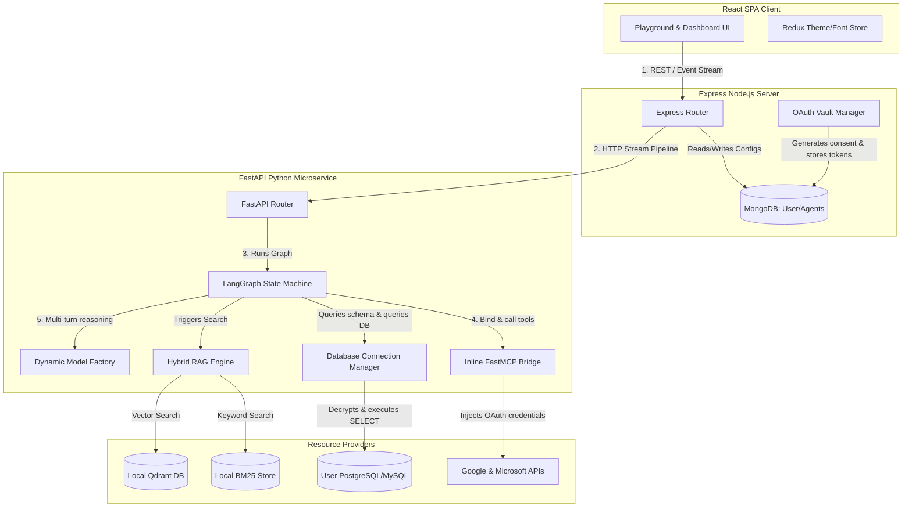
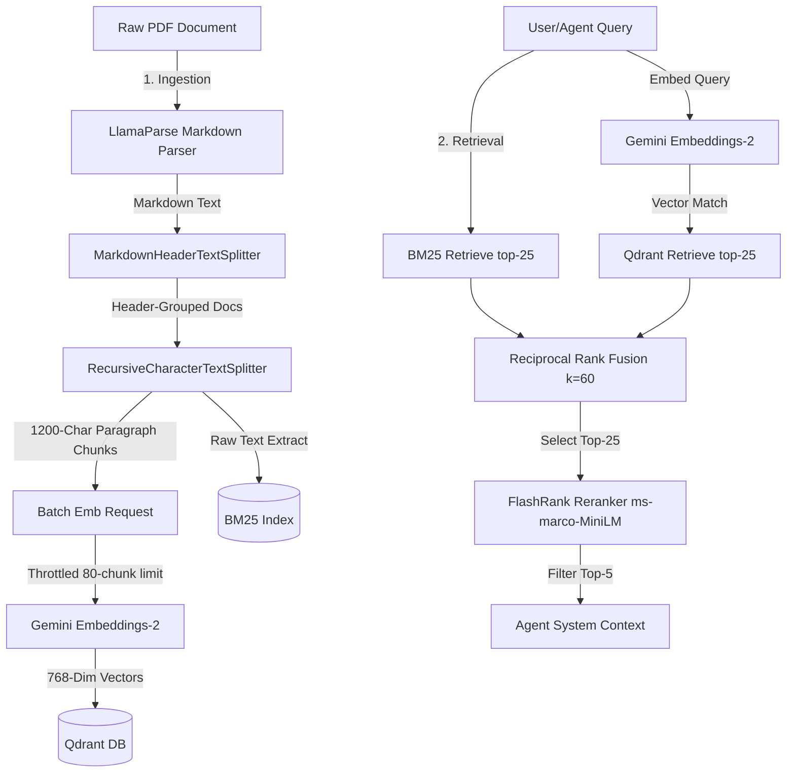
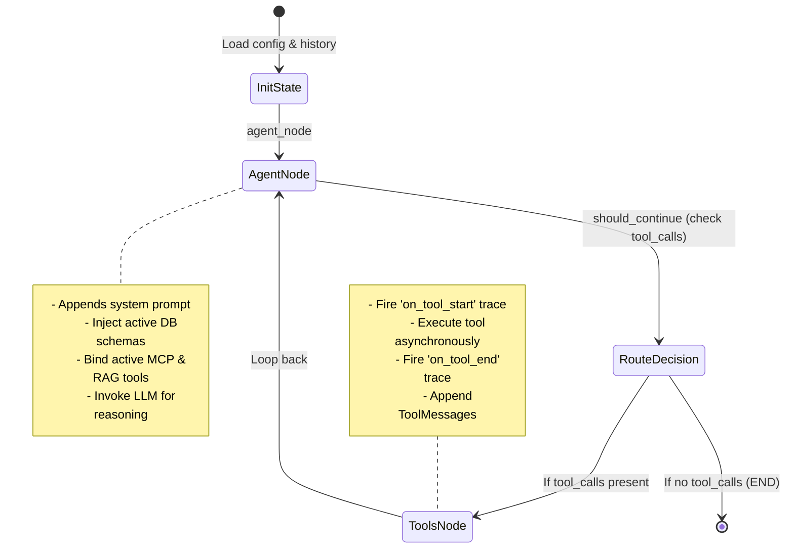

# 🚀 AI Agent Platform: Technical Architecture & Feature Guide

Welcome to the **AI Agent Platform** technical guide. This document provides an exhaustive, low-level architectural breakdown of the platform's systems, showcasing how it manages Model Context Protocol (MCP) servers, implements a high-fidelity Hybrid RAG pipeline, manages database connections, schedules intelligent LangGraph agent loops, and maintains a custom global layout theme/font engine.

---

## 🏗️ 1. Overall System Architecture

The  AI Agent Platform is designed as a decoupled, multi-layer service mesh. It leverages a Node.js Express server to handle API routing, OAuth authentication, and metadata persistence, while delegating heavy computational tasks, database operations, and LLM orchestration to a Python FastAPI microservice.

Below is the workflow of the platform, from user request to tool execution:



---

## 🔌 2. Managed MCP & Native Tools

The platform provides a highly flexible tool management layer that brings together standard local actions (native tools) and the decentralized **Model Context Protocol (MCP)**.

### The Standard MCP Protocol
MCP is an open standard that decouples tools and resources from the LLM reasoning core. Normally, calling an MCP tool requires running an external process and sending JSON-RPC messages back and forth over `stdin`/`stdout` or HTTP SSE. While robust, this setup introduces network overhead, latency, and complex process lifecycle management.

### The  Inline FastMCP Bridge
To maximize execution speed while retaining the benefits of MCP's decoupled design,  implements a custom **inline FastMCP Bridge** (`ai_engine/app/tools/mcp_bridge.py`):

1. **Local Server Import & Registration**: The Python engine directly imports the FastMCP server object (`from AI_Platform_MCP.app import mcp`) and all tool files. This triggers the `@mcp.tool()` decorators, registering them directly in memory.
2. **LangChain Tool Wrapping**: Rather than making network requests, `mcp_bridge.py` inspects the registered tools (`mcp._tool_manager.list_tools()`) and wraps them as LangChain `StructuredTool` objects. It retains their exact metadata schemas (`tool_info.fn_metadata.arg_model`) and descriptions so the LLM can generate parameters correctly.
3. **Mock Request Context Injection**: This is the key detail. Many SaaS tools (like Gmail or Outlook) require OAuth tokens. 's bridge intercepts the user's `auth_vault` from the Express backend, extracts the appropriate access token (based on tool name prefixes, e.g., `gmail_` or `outlook_`), wraps them in a `MockContext`, and executes the tool manager directly:
   ```python
   # Excerpt from ai_engine/app/tools/mcp_bridge.py
   ctx = MockContext(meta_data={"x-google-oauth-token": token})
   result = await mcp._tool_manager.call_tool(name, arguments, context=ctx, convert_result=True)
   ```
   This approach runs the tool code locally inside the same Python process, bypassing IPC/HTTP overhead while maintaining compatibility with the MCP standard.

### SaaS OAuth Authentication & Token Vault
Third-party SaaS integrations are managed securely through a stateful authentication workflow:
* **Consent Generation**: When a user clicks "Connect" in the dashboard, the Express server (`backend/routes/authRoutes.js`) generates a secure, signed JWT token representing the logged-in user and passes it as the OAuth `state` parameter to Google or Microsoft.
* **Callback Capture**: Upon consent, Google/Microsoft redirects to the backend callback endpoint. The server verifies the JWT `state` to ensure authenticity, retrieves the access and refresh tokens, and saves them to the MongoDB `User` document under `oauth_vault`.
* **Automatic UI Handshake**: The callback response returns a script block containing `window.close()`, closing the popup window and signaling the React frontend to refresh the connection status.
* **Token Rotation**: The system supports background token usage and maps these tokens directly to the agent's MCP execution context whenever SaaS tools are requested.

### Simulated Fallback Mechanisms
To guarantee high developer productivity and smooth local demonstrations even without valid external OAuth tokens or internet connectivity, the MCP tool modules (e.g., `AI_Platform_MCP/tools/google/mail.py` and `AI_Platform_MCP/tools/microsoft/mail.py`) feature automatic fallback structures:
* If the OAuth token is missing, expired, or marked as a mock, the tool catches the failure, logs a warning, and returns a realistic simulated response (e.g., mock email threads, search results, or successful message transmissions).
* This design keeps agents operational during local development or network disruptions.

---

## 🧠 3. Advanced Hybrid RAG (Retrieval-Augmented Generation)

To provide precise factual grounding, the platform features a highly optimized Hybrid RAG pipeline. It blends traditional keyword searches with dense semantic vector searches, fuses their scores, and refines the output using cross-encoder rerankers.



### Ingestion Pipeline
1. **Semantic Document Parsing**: Uploaded PDF files are sent to the FastAPI ingestion route (`/api/engine/knowledge/ingest`). It uses **LlamaParse** in Markdown mode to extract text. This preserves visual tables, headers, and bullet structures that standard PDF parsers often destroy.
2. **Two-Stage Structural Chunking**: 
   - *Stage 1*: Text is processed by a `MarkdownHeaderTextSplitter`, which splits documents by header levels (`#`, `##`, `###`). This keeps logical sections grouped together.
   - *Stage 2*: To keep chunks within an optimal size for embedding models, these section-grouped documents are split using a `RecursiveCharacterTextSplitter` with a `chunk_size` of 1200 characters and a `chunk_overlap` of 200 characters.
3. **Throttled Batch Embeddings**: The chunks are embedded using Gemini's state-of-the-art `models/gemini-embedding-2` model (768 output dimensions). To accommodate free-tier keys, the Python engine groups requests into batches of 80 chunks and sleeps for 60 seconds between batches:
   ```python
   # Rate limit handler in ai_engine/app/main.py
   if i + batch_size < len(chunks):
       print("Sleeping for 60 seconds to respect the 30K Tokens-Per-Minute limit...")
       await asyncio.sleep(60)
   ```
4. **Dual Persistent Storage**:
   - **Vector Store**: Chunks and their embeddings are uploaded to a local persistent instance of **Qdrant** (`app/data/qdrant_db`).
   - **Keyword Store**: The raw text chunks are tokenized and compiled into a **BM25 keyword index** (using python's `rank_bm25`'s `BM25Okapi` serialized to disk via pickle).

### Retrieval Pipeline (Hybrid Search & Reranking)
When the agent invokes the search tool, the RAG engine performs a two-pass search:
1. **Parallel Candidates Retrieval**: It retrieves the top 25 chunks matching the query from the BM25 keyword index and the top 25 chunks from the Qdrant vector index.
2. **Reciprocal Rank Fusion (RRF)**: To combine keyword matches and semantic matches without needing to normalize scores, it fuses the results using RRF (with a constant $K=60$):
   $$Score_{RRF}(d) = \sum_{m \in M} \frac{1}{K + r_m(d)}$$
   The candidates are sorted by their fused scores, and the top 25 are selected.
3. **Cross-Encoder Reranking**: The top 25 candidate chunks are sent through a local **FlashRank** reranker using the lightweight `ms-marco-MiniLM-L-12-v2` cross-encoder model. This evaluates the exact semantic relationship between the query and each chunk. The top 5 highest-scoring chunks are returned.
4. **Dynamic Agent Injection**: The platform wraps these searches into custom tools (named `search_kb_{name}`) and binds them dynamically to the agent, providing it with real-time access to the parsed documents.

---

## 🗄️ 4. Database Connectivity & Security Guardrails

The platform makes connecting databases simple and secure, allowing agents to inspect schemas and run queries against SQL databases while enforcing strict access controls.

### Secure Credentials Vault
Database credentials are protected using two-way encryption:
* **Express Encryption**: When a database connection is configured, the Express server (`backend/routes/databaseRoutes.js`) encrypts the password using **AES-256-GCM** with a random Initialization Vector (IV). Only the encrypted text and IV are stored in MongoDB.
* **FastAPI Decryption**: When the database needs to be accessed, the Python engine retrieves the encrypted details and decrypts the password using a 32-byte key derived from the environment's `ENCRYPTION_KEY` using SHA-256:
  ```python
  # Excerpt from ai_engine/app/utils/db_manager.py
  key = hashlib.sha256(encryption_key.encode("utf-8")).digest()
  aesgcm = AESGCM(key)
  decrypted_bytes = aesgcm.decrypt(bytes.fromhex(iv), bytes.fromhex(encrypted_password), None)
  ```

### Connection Management & Schema Reflection
* **Connection Pooling**: Decrypted credentials are used to spin up SQLAlchemy connection engines. The platform configures these engines with connection pooling (`pool_size=5`, `max_overflow=10`, `pool_pre_ping=True`) to handle connection reuse and automatic reconnects efficiently.
* **Schema Reflection**: SQLAlchemy's `inspect` utility queries the database schema to identify tables, columns, data types, primary keys, and foreign keys.
* **FastAPI Schema Cache**: To avoid querying the database for metadata on every turn, reflected schemas are stored in a memory cache. This schema is made available to the agent so it can write accurate queries.

### Security Gates & Guardrails
Allowing an AI agent to execute arbitrary SQL is a security risk.  implements a strict security gate in `AI_Platform_MCP/tools/database/db_tools.py` via `validate_sql(query)`:
* **Single Statement Verification**: The query is parsed using `sqlparse`. If it contains more than one SQL statement (e.g., separated by a semicolon), execution is blocked.
* **Read-Only Enforcer**: The parser checks the query type. **Only `SELECT` statements are permitted.** Any operations attempting to modify data (such as `INSERT`, `UPDATE`, `DELETE`, `DROP`, or `ALTER`) throw a security exception.
* **Row-Count Cap**: The system queries up to 51 rows. If more than 50 rows are returned, it truncates the result to 50 rows and sets a flag (`has_more = True`). This prevents excessive token usage from large database tables.

---

## 🔁 5. Intelligent LangGraph Agent Loops

At the core of the platform's execution layer is a stateful **LangGraph** orchestration loop. This loop structures how the agent moves between reasoning, tool execution, and user feedback.



### Graph Lifecycle & State Schema
The state machine is defined using a LangGraph `StateGraph` and the `AgentState` type definitions (`ai_engine/app/agents/state.py`):
* **State Properties**: The state holds `messages` (using `add_messages` to merge message history), `instructions`, `tools` (list of registered MCP/native tools), `auth_vault` (user OAuth tokens), model configuration, active knowledge base/database connections, and a structured `trace` array.
* **Dynamic Context Injection**: If database connections are active, the graph node formats details about each active database (name, engine, and connection ID) and appends them to the agent's instructions, ensuring the agent knows which database to target.
* **Conditional Routing**: The `should_continue` conditional edge checks the LLM's response. If the LLM requests a tool call, the state machine routes to the `tools` node; otherwise, it stops and routes to `END`.

### Real-Time Trace Streaming
To display the agent's reasoning process in the frontend, the platform uses Server-Sent Events (SSE) to stream execution traces:
1. **Trace Generation**: The `tools` and `agent` nodes record logs (e.g., `on_llm_start`, `on_tool_start`, `on_tool_end`) along with arguments and outputs as they run.
2. **FastAPI Event Generator**: The run endpoint (`/api/engine/run`) executes the compiled state machine using `astream` to capture events as they occur:
   ```python
   async for event in compiled_graph.astream(initial_state):
       for node_name, node_output in event.items():
           trace_list = node_output.get("trace", [])
           for trace_item in trace_list:
               yield f"data: {json.dumps(trace_item)}\n\n"
   ```
3. **Node.js Piping**: The Express backend proxies the request to FastAPI with `responseType: 'stream'` and pipes the raw data directly to the client. The React frontend uses an EventSource reader to show these reasoning logs in real time.

---

## 🎨 6. Theme & Font Customization System

To deliver a premium developer experience, the platform features a customizable UI with VS Code-style color themes and selectable typographies.

### CSS Variables & System Themes
Instead of hardcoded Tailwind CSS utility classes, the application UI is styled using semantic CSS variables defined in `frontend/src/index.css`. The platform includes four default themes:
1. **Default Light**: Clean, high-contrast light workspace.
2. **One Dark Pro**: Premium dark-slate theme modeled after Atom/VS Code.
3. **Dracula**: High-contrast dark theme using vibrant accents.
4. **Solarized Dark**: Warm, low-contrast dark theme designed for comfortable reading.

### Font Engine
The platform imports Google Fonts at the top of the stylesheet and supports three main typographies:
* **Inter**: Default clean sans-serif UI font.
* **Fira Code**: High-contrast monospace font with code ligatures.
* **JetBrains Mono**: Premium monospace font optimized for developer interfaces.

### Redux State Machine & Database Synchronization
1. **Local Dispatches**: When a user selects a theme or font, the application dispatches an action to the `themeSlice` Redux store.
2. **DOM Updates**: The Redux slice updates the application wrapper's theme attribute and body font family dynamically:
   ```javascript
   document.documentElement.setAttribute('data-theme', themeName);
   document.body.style.fontFamily = fontMapping[fontName];
   ```
3. **Local Storage**: Selections are saved to `localStorage` so they persist across page refreshes.
4. **MongoDB Persistence**: The application makes a JWT-protected request to the user settings endpoint (`PATCH /api/user/settings`). This updates the settings in the user's MongoDB document, ensuring a consistent experience across different devices.

### Interactive Previews
The theme page (`frontend/src/pages/ThemeFonts.jsx`) features interactive preview cards for each theme. These cards display a miniature mockup of the sidebar, canvas, and card layouts using the theme's colors, allowing users to preview the visual contrast before applying changes.

---

## 💡 Summary of Project Highlights

| Feature | Technical Implementation | Core Benefit |
| :--- | :--- | :--- |
| **Inline MCP Bridge** | Direct memory imports and `MockContext` generation bypassing standard HTTP/stdio transport loops. | Bypasses network overhead while remaining compatible with MCP standards. |
| **SaaS OAuth Vault** | Popup consent handlers, JWT verification, and encrypted backend storage for credentials. | Gives agents secure access to services like Gmail and Outlook without compromising credentials. |
| **Hybrid RAG** | LlamaParse + two-stage Markdown chunking + BM25 keyword search + Qdrant dense vector search + RRF + FlashRank reranking. | Delivers highly relevant context to queries while protecting against embedding rate limits. |
| **SQL Security Gate** | SQL parser verification checks that enforce single-statement, read-only SELECT queries. | Protects database connections from SQL injection and unauthorized data modification. |
| **LangGraph ReAct Loop** | Compiled LangGraph state machine with dynamic database context injection and SSE stream piping. | Allows agents to run multi-turn tasks while providing real-time visibility into their reasoning. |
| **Dynamic Theme Engine** | Redux state syncing, dynamic CSS variables, and persistent user profile settings in MongoDB. | Provides a premium, customizable UI with live contrast previews. |
